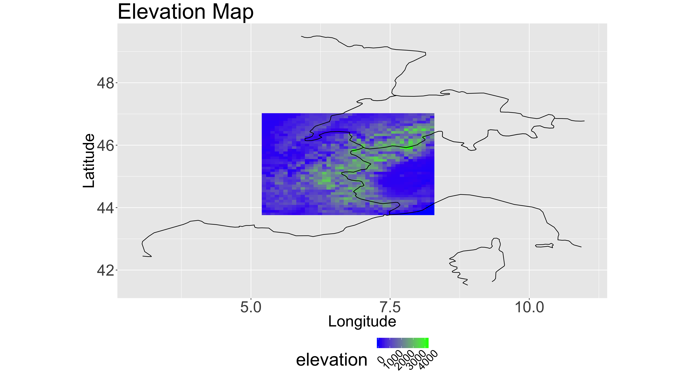
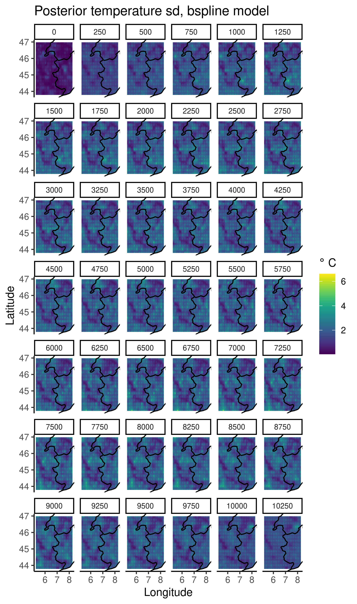

```{r setup, message = FALSE, include=FALSE, echo = FALSE}
knitr::opts_chunk$set(echo = TRUE)
library(here)
library(tidyverse)
```


# Data Science Statistics 2021

Welcome:

- A little about me

- How did I get into statistics?

```{r, echo = FALSE, out.width="70%", fig.align='center'}

```

---


# What is data science?

--

```{r, echo = FALSE, out.width="80%", fig.align='center'}
knitr::include_graphics("./images/frequentists_vs_bayesians_2x.png")
```

---

# What is data science?

- Data

- Statistics

- Computation

- Interpretation/communication

- Domain knowledge

---

# What is my experience in data science

- Collaborative

  - Learn and work with different groups
  
  - Requires knowledge and expertise 

--

- Dynamic

  - Always new things to learn
  
  - New skills and techniques

--

- Communication and interpersonal skills

  - Lots of writing and communication    
  
  - Networking to develop opportunities and projects
  
---

# Statistics

- The mathematics underlying data science

---


# Modeling

In general, all statistical models (AI/ML/etc. -- choose your favorite term) are some flavor of **regression!**

$$
y_i = \beta_0 + \beta_1 x_i + \epsilon_i
$$

```{r}
n <- 500
beta_0 <- 2
beta_1 <- 3
x <- seq(-1, 1, length = n)
epsilon <- rnorm(n, 0, 0.25)
y <- beta_0 + beta_1 * x + epsilon
```

---

# Modeling


```{r, echo = FALSE, fig.align='center', message = FALSE}
dat <- data.frame(mu = beta_0 + beta_1 * x, y = y, x = x)
ggplot(dat, aes(x = x, y = y)) +
  geom_point() +
  stat_smooth(method = "lm")
```


---

# Modeling

```{r, echo = FALSE}
if (!file.exists(here::here("images", "regression-animation.gif"))) {
    make_plot <- function() {
        
        ## Compute densities for each section, and flip the axes, and add means of sections
        ## Note: the densities need to be scaled in relation to the section size (2000 here)
      
      ## breaks: where you want to compute densities
      n_breaks <- length(dat$x)
      breaks <- seq(min(dat$x), max(dat$x), len = n_breaks)[-c(1, n_breaks)]
      dat$section <- cut(dat$x, breaks)


        ys <- seq(-1, 5, length = 500)
        for (i in 1:n_breaks) {
            xs <- rep(breaks[i], each = 500) + dnorm(ys, 0, 0.25)
            
            res <- beta_0 + beta_1 * x[i] + ys 
            dens <- data.frame(x = xs, y = c(res))
            # dens <- data.frame(x = xs, y=c(res), 
            #                    grouping = cut(xs, breaks))
            p <- ggplot(dat, aes(x, y)) +
                geom_point(size = 2) +
                geom_line(aes(x = x, y = mu), lwd=2) +
                # geom_smooth(method="lm", fill=NA, lwd=2, se = FALSE) +
                # geom_path(data=dens, aes(x, y, group = grouping), 
                geom_path(data = dens, aes(x, y), 
                          color = "salmon", lwd = 2) +
                theme_bw() +
                geom_vline(xintercept=breaks[i], lty=2) +
                ylim(c(-3, 7)) +
                xlim(c(-1, 1))
            print(p)
        }
    }
    
    gifski::save_gif(
        make_plot(),
        gif_file = here::here("images", "regression-animation.gif"), 
        width = 1600, 
        height = 900,
        progress = TRUE,
        delay = 0.05#, 
        # height = 800, width = 600, units = "px"
    )
}
```


.center[

]

---

# Modeling

* If all we have is a linear model, all we can fit are linear functions

* Is this a good model fit?


```{r, echo = FALSE}
n <- 500
beta_0 <- 2
beta_1 <- 3
beta_2 <- -2
x <- seq(-1, 1, length = n)
epsilon <- rnorm(n, 0, 0.25)
y <- beta_0 + beta_1 * x + beta_2 * x^2 + epsilon
```

```{r, echo = FALSE, fig.align='center', message = FALSE}
dat <- data.frame(mu = beta_0 + beta_1 * x, y = y, x = x)
ggplot(dat, aes(x = x, y = y)) +
  geom_point() +
  stat_smooth(method = "lm")
```


---

# Modeling

* How do we make that model better?

---

# Modeling

* Quadratic term?


$$
y_i = \beta_0 + \beta_1 x_i + \beta_2 x_i^2 + \epsilon_i
$$

---

# Modeling

* In general, statistical modeling can be written as

$$
y_i = f(x_i) + \epsilon_i
$$


.pull-left[
* Goal: find the function $f(\cdot)$ that best approximates the observed data $y_i$ given inputs $x_i$

* Example: let $x_i$ be an image, $y_i$ is the label cat, $f(\cdot) = ???$
]


.pull-right[

]

---


# Modeling

* The goal is to model $f(\cdot)$

--

* What ways can we improve the model $f(\cdot)?$

--

* Break up $f(\cdot)$ into small pieces

--

* Called a "basis" for $f(\cdot)$

    * 1 and $x$ are a basis for linear functions
    
    * 1, $x$, and $x^2$ are a basis for quadratic functions
    


---

# Modeling

* Is this basis of step functions a better fit?

```{r, echo = FALSE, fig.out='center', message = FALSE}

make_basis <- function(x, knots, radius, form = "uniform") {
    # evaluate the kernel/basis in 1d
    if (!(form %in% c("uniform", "gaussian", "exponential", "polynomial"))) {
        stop('form must be either "uniform" or "gaussian" or "exponential" or "polynomial" ...')
    }
    n       <- length(x)
    n_knots <- length(knots)
    basis   <- matrix(0, n, n_knots)
    for (i in 1:n_knots) {
        if (form == "uniform") {
            basis[, i] <- ifelse(abs(x - knots[i]) < radius, 1, 0)
        }
        if (form == "gaussian") {
            basis[, i] <- dnorm((x - knots[i]) / radius)
        }
        if (form == "polynomial") {
            basis[, i] <- ifelse(abs(x - knots[i]) < radius, (1 - abs(x - knots[i])^3 / radius^3)^3, 0)
        }
        if (form == "exponential") {
            basis[, i] <- dexp(abs((x - knots[i]) / radius))
        }
    }
    return(basis)
}

knots <- seq(min(x), max(x), by = 0.4)#[-length(knots)]
Z <- make_basis(x, knots, radius = 0.2, form = "uniform")
fit <- lm(y ~ Z-1)
alpha_fit <- coefficients(fit)
```


.pull-left[
```{r, echo = FALSE, warning = FALSE}
# plot the fitted line
dat <- data.frame(mu = Z %*% alpha_fit, y = y, x = x)
dat$mu[1] <- NA
ggplot(dat, aes(x = x, y = y)) +
  geom_point() +
  geom_line(aes(x=x, y = mu), color = "red", lwd = 2)
```
]

.pull-right[
```{r, echo = FALSE, warning = FALSE}
dimnames(Z) <- list(obs = 1:nrow(Z), knots = 1:ncol(Z))
dat_Z <- as.data.frame.table(Z, responseName = "basis") %>%
  mutate(obs = as.numeric(obs))
dat_obs <- data.frame(y = y, x = x, obs = 1:n, mu = Z %*% alpha_fit)
dat <- left_join(dat_Z, dat_obs, by = "obs") %>%
  mutate(knots = as.numeric(knots)) %>%
  left_join(data.frame(alpha = alpha_fit, knots = 1:length(knots)), by = "knots") %>%
  group_by(knots) %>%
  mutate(weighted_basis = basis * alpha)

dat$basis[dat$basis == 0] <- NA
dat$weighted_basis[dat$weighted_basis == 0] <- NA

ggplot(dat, aes(x = x, y = basis, color = as.factor(knots))) +
  # geom_line(alpha = 0.5) +
  geom_line(aes(x = x, y = weighted_basis), lwd= 2) +
  geom_point(aes(x = x, y = y), color = "black") 
  # geom_line(aes(x=x, y = mu), color = "orange", lwd = 2)
```
]

---

# Modeling

* What about this basis of "smooth" functions


.pull-left[

```{r, echo = FALSE, warning = FALSE}
knots <- seq(min(x), max(x), by = 0.4)#[-length(knots)]
Z <- make_basis(x, knots, radius = 0.2, form = "gaussian")
fit <- lm(y ~ Z-1)
alpha_fit <- coefficients(fit)# plot the fitted line
dat <- data.frame(mu = Z %*% alpha_fit, y = y, x = x)
dat$mu[1] <- NA
ggplot(dat, aes(x = x, y = y)) +
  geom_point() +
  geom_line(aes(x=x, y = mu), color = "red", lwd = 2)
```
]


.pull-right[
```{r, echo = FALSE, warning = FALSE}
dimnames(Z) <- list(obs = 1:nrow(Z), knots = 1:ncol(Z))
dat_Z <- as.data.frame.table(Z, responseName = "basis") %>%
  mutate(obs = as.numeric(obs))
dat_obs <- data.frame(y = y, x = x, obs = 1:n, mu = Z %*% alpha_fit)
dat <- left_join(dat_Z, dat_obs, by = "obs") %>%
  mutate(knots = as.numeric(knots)) %>%
  left_join(data.frame(alpha = alpha_fit, knots = 1:length(knots)), by = "knots") %>%
  group_by(knots) %>%
  mutate(weighted_basis = basis * alpha)

dat$basis[dat$basis == 0] <- NA
dat$weighted_basis[dat$weighted_basis == 0] <- NA

ggplot(dat, aes(x = x, y = basis, color = as.factor(knots))) +
  # geom_line(alpha = 0.5) +
  geom_line(aes(x = x, y = weighted_basis), lwd= 2) +
  geom_point(aes(x = x, y = y), color = "black") #+
  # geom_line(aes(x=x, y = mu), color = "orange", lwd = 2, alpha = 0.5)
```
]


---


# What makes the DSST track unique

- Focus on the underlying mathematics that makes data science work

--

- Fundamental understanding of the modeling methods and techniques of statistical data science

--

- The strong mathematical background will enable you to learn and progress much faster to future changes in the field

--

- Flexibility to work in multiple domains of interest

    - John Tukey -- "The best thing about being a statistician, is that you get to play in everyone's backyard."

--

- About 3/4 of data scientists have a [Master's degree or higher](https://ischoolonline.berkeley.edu/blog/data-scientist-salary/)

   - The mathematical rigor of the DSST track make pursuing a Master's degree more approachable

---

# DSST Core courses

- Introduction to Mathematical statistics
--

  - Use limits to understand central limit theorem
  
  - Understand concepts like sufficiency, unbiasedness, estimation, and decision
  
--

- Experimental design
--

    - Modeling designed experiments (A/B testing)
    
    - Useful for advertising/marketing
    
--

- Statistical Forecasting and Prediction
--

  - Modeling data over time
  
  - Accounting for autocorrelation and correlated data
  
--

- Analysis of categorical data

    - Generalized linear models (non-Gaussian data)

---

# DSST Course Electives

- Bayesian Methods
--

  - Model building, regularization, classification, and prediction
  
  - Understand constructive/probabilistic model building using probability distributions
  
--

- Nonparametric statistical methods
--

  - Models for data where the distribution is not Gaussian
  
  
---

# Why statistics

- Statistics is the process of making decisions under uncertainty
--

  - In the real world, there is **always** uncertainty
  
--


- Statistics teaches about the process and pitfalls when collecting data
--

  - Is a sample of a single randomly chosen individual in the US representative?
  
--

- Statistics is the *lingua franca* of science
--

   - Science and decision making is primarly concerned with statistics

--

* Statistics develops critical thinking and analytic skills

--

* Statisticians are highly paid and have rewarding careers
--

  * [Statistics](https://money.usnews.com/careers/best-jobs/rankings/the-100-best-jobs?name=Statistician)
  * [Data science](https://money.usnews.com/careers/best-jobs/rankings/the-100-best-jobs?name=Data%20Scientist)

  
---

# Why statistics

Abraham Wald

```{r, echo = FALSE, fig.align = 'center', out.width = '80%'}

```


---

# Why statistics

* In the UK, 70% of the covid deaths are among those that are vaccinated [Public Health England](https://www.factcheck.org/2021/11/scicheck-why-its-easy-to-misinterpret-numbers-of-deaths-among-the-vaccinated/)
--

  * Does the covid-19 vaccination work?

--

* Unvaccinated individuals are 13 times more likely to become infected and 20 times more likely to experience death due to covid-19 than unvaccinated individuals [Texas Department of Health](https://www.dshs.texas.gov/immunize/covid19/data/cases-and-deaths-by-vaccination-status-11082021.pdf)
--

  * Does the covid-19 vaccination work?
  
--

* How can both of these be true?


---

# Why statistics

```{r, echo = FALSE, fig.align = 'center', out.width = '80%'}

```

---

# Why statistics

<p align="center"><iframe width="560" height="315" src="https://www.youtube.com/embed/wV0Ks7aS7YI" title="YouTube video player" frameborder="0" allow="accelerometer; autoplay; clipboard-write; encrypted-media; gyroscope; picture-in-picture" allowfullscreen></iframe></p>


---

# Questions?


<!-- --- -->

<!-- # Projects  -->

<!-- - Climate from tree rings -->

<!-- - Mineral formation and sedimentation -->

<!-- - Cancer identification -->

<!-- - Historical forest distributions -->

<!-- --- -->

<!-- # Climate proxy data -->

<!-- * Many ecological and physical processes respond to climate over different time scales. -->
<!--     * Tree rings, corals, forest landscapes, ice rings, lake levels, etc. -->

<!-- * These processes are called **climate proxies**. -->
<!--     * They are proxy measurements for unobserved climate. -->
<!--     * Noisy and messy. -->
<!--     * Respond to a wide variety of non-climatic signals. -->


<!-- --- -->

<!-- # PalEON -->

<!-- <center> -->
<!--   -->
<!-- </center> -->

<!-- \blfootnote{\tiny{\textit{http://www.theatlantic.com/science/archive/2016/03/the-worlds-most-urgent-science-project/474558}.}} -->

<!-- --- -->

<!-- # PalEON -->

<!-- <center> -->
<!--   -->
<!--   -->
<!-- </center> -->


<!-- --- -->

<!-- # Forward Model -->


<!-- <div class="newspaper">  -->

<!-- <center> -->
<!--   -->
<!-- </center> -->

<!-- <hr style="height:20px; visibility:hidden;" /> -->

<!-- <center><font size="+6">Data.</font></center> -->

<!-- <hr style="height:80px; visibility:hidden;" /> -->

<!-- <center><font size="+6">Data Model.</font></center> -->

<!-- <hr style="height:80px; visibility:hidden;" /> -->

<!-- <center><font size="+6">Process Model.</font></center> -->


<!-- <hr style="height:20px; visibility:hidden;" /> -->

<!-- </div> -->

<!-- --- -->


<!-- # Inverse Model -->


<!-- <div class="newspaper">  -->

<!-- <center> -->
<!--   -->
<!-- </center> -->

<!-- <hr style="height:20px; visibility:hidden;" /> -->

<!-- <center><font size="+6">Data.</font></center> -->

<!-- <hr style="height:80px; visibility:hidden;" /> -->

<!-- <center><font size="+6">Data Model.</font></center> -->

<!-- <hr style="height:80px; visibility:hidden;" /> -->

<!-- <center><font size="+6">Process Model.</font></center> -->


<!-- <hr style="height:20px; visibility:hidden;" /> -->

<!-- </div> -->

<!-- --- -->

<!-- # The Data -->

<!-- <center> -->
<!--   -->
<!-- </center> -->

<!-- --- -->

<!-- # Data Model -->


<!-- \begin{align*} -->
<!-- [\mathbf{z}, \boldsymbol{\theta}_D, \boldsymbol{\theta}_P | \mathbf{y}] & \propto -->
<!-- \color{red}{[\mathbf{y} | \boldsymbol{\theta}_D, \mathbf{z}]}  [\mathbf{z} | \boldsymbol{\theta}_P] [\boldsymbol{\theta}_D] [\boldsymbol{\theta}_P] -->
<!-- \end{align*} -->


<!-- --- -->

<!-- # Climate Data Model -->

<!-- \begin{align*} -->
<!-- \begin{pmatrix} -->
<!-- \mathbf{T}_{t} \\  -->
<!-- \mathbf{P}_{t}  -->
<!-- \end{pmatrix} =  -->
<!--  \begin{pmatrix}  -->
<!-- \mathbf{T}_{\mbox{Jan}, t} \\ -->
<!-- \vdots \\ -->
<!-- \mathbf{T}_{\mbox{Dec}, t} \\ -->
<!-- \mathbf{P}_{\mbox{Jan}, t} \\ -->
<!-- \vdots \\ -->
<!-- \mathbf{P}_{\mbox{Dec}, t} \\  -->
<!-- \end{pmatrix}  \sim \color{red}{\mbox{N} \left( \mathbf{A} \begin{pmatrix} -->
<!-- \mathbf{T}_{t-1} \\  -->
<!-- \mathbf{P}_{t-1}  -->
<!-- \end{pmatrix}, \boldsymbol{\Sigma} \right).} -->
<!-- \end{align*} -->


<!-- <hr style="height:20px; visibility:hidden;" /> -->

<!-- * Temperature and precipitation in sequential months (years) are more related to each other than months (years) far apart. -->


<!-- --- -->

<!-- # Tree Ring Data Model -->

<!-- \begin{align*} -->
<!-- y_{i t j} & \sim \color{red}{\begin{cases} \mbox{N}\left(\beta_{0_j} + \beta_{1_j} f^{VS}\left(\mathbf{w}_t, \boldsymbol{\theta}^{VS}_j\right), \sigma^2_j \right) & \mbox{if } z_j = 0,\\ \mbox{N}\left(\tilde{\beta}_{0_j} + \tilde{\beta}_{1_j} f^{Pro}\left(\mathbf{w}_t, \boldsymbol{\theta}^{Pro}_j\right), \tilde{\sigma}^2_j \right) & \mbox{if } z_j = 1. \\ -->
<!-- \end{cases}} -->
<!-- \end{align*} -->

<!-- <hr style="height:20px; visibility:hidden;" /> -->

<!-- * Regress observed tree ring $y_{itj}$ onto simulated tree rings $f^{VS}\left(\mathbf{w}_t, \boldsymbol{\theta}^{VS}_j\right)$ and $f^{Pro}\left(\mathbf{w}_t, \boldsymbol{\theta}^{Pro}_j\right)$. -->

<!-- <hr style="height:20px; visibility:hidden;" /> -->

<!-- * $z_j$ - species specific growth model form (VS or Pro). -->

<!-- <hr style="height:20px; visibility:hidden;" /> -->

<!-- * Model chooses best growth model form for each species. -->


<!-- --- -->

<!-- # Process Model -->

<!-- \begin{align*} -->
<!-- [\mathbf{z}, \boldsymbol{\theta}_D, \boldsymbol{\theta}_P | \mathbf{y}] & \propto -->
<!-- [\mathbf{y} | \boldsymbol{\theta}_D, \mathbf{z}]  \color{blue}{[\mathbf{z} | \boldsymbol{\theta}_P]}[\boldsymbol{\theta}_D] [\boldsymbol{\theta}_P] -->
<!-- \end{align*} -->

<!-- --- -->

<!-- # Tree Ring Growth Model -->

<!-- <center> -->
<!--   -->
<!-- </center> -->

<!-- <hr style="height:20px; visibility:hidden;" /> -->

<!-- \begin{align*} -->
<!-- f^{\ell}\left(\mathbf{w}_t, \boldsymbol{\theta}^{\ell}_j\right) & = \color{blue}{ \sum_{s=1}^{12} \chi_s \mbox{min} \left( -->
<!--               g^{\ell}\left( T_{t,s}, -->
<!--               \boldsymbol{\theta}^{\ell}_j \right), -->
<!--               g^{\ell}\left( P_{t, s}, -->
<!--               \boldsymbol{\theta}^{\ell}_j \right) \right),} \\ -->
<!--               & \ell = VS \mbox{ or } Pro.  -->
<!-- \end{align*} -->

<!-- --- -->

<!-- # Tree Ring Growth Model -->

<!-- ```{r, cache=TRUE, fig.show="animtae", fig.align = "center", interval=0.5, echo = FALSE, fig.width = 16, fig.height = 9} -->
<!-- load('./data/hudsonValleyData.RData')   -->
<!-- dd_temp<-data.frame(year=Temp.avg.dat[, 1], month = Temp.avg.dat[, 2], temp=apply(Temp.avg.dat[, 3:36], 1, mean)) -->
<!-- dd_temp <- dd_temp[order(dd_temp$year, dd_temp$month), ] -->
<!-- dd_precip<-data.frame(year=Precip.dat[, 1], month = Precip.dat[, 2], precip=apply(Precip.dat[, 3:36], 1, mean)) -->
<!-- dd_precip <- dd_precip[order(dd_precip$year, dd_precip$month), ] -->
<!-- dd_temp <-dd_temp[1:36, ] -->
<!-- dd_temp[, 3] <- (dd_temp[, 3] - mean(dd_temp[, 3])) / sd(dd_temp[, 3]) -->
<!-- dd_precip <-dd_precip[1:36, ] -->
<!-- dd_precip[, 3] <- (log(dd_precip[, 3]) - mean(log(dd_precip[, 3]))) / sd(log(dd_precip[, 3])) -->
<!-- growth <- rep(NA, length(dd_temp$month)) -->
<!-- for(i in 1:length(dd_temp$month)){ -->
<!-- 	growth[i] <- min(pnorm(dd_precip[,  3][i], 0, 1),  -->
<!-- 									 pnorm(dd_temp[, 3][i], 0, 1)) -->
<!-- } -->
<!-- # growth <- (growth - mean(growth)) / sd(growth) -->
<!-- growth <- growth / sd(growth) -->
<!-- growth_year <- rep(NA, 36) -->
<!-- growth_year[1:12] <- cumsum(growth[1:12]) -->
<!-- growth_year[13:24] <- cumsum(growth[13:24]) -->
<!-- growth_year[25:36] <- cumsum(growth[25:36]) -->
<!-- growth_year <- 4*growth_year / max(growth_year) -->
<!-- for(i in 1:36){ -->
<!-- # 	jpeg(file = paste('growthAnimationMultiscale', i, '.jpg', sep=''), width = 16, height = 9, quality = 100, res = 600, units = 'in') -->
<!-- 	par(mar=c(5, 4, 4, 2) + 0.1 + c(0, 2, 0, 0)) -->
<!-- 	layout(matrix(c(1,2,3,4,5,6), 2, 3, byrow = TRUE)) -->
<!-- # 	layout(matrix(c(1,1,2,2,3,3,4,4,5,5,6,6), 2, 6, byrow = TRUE)) -->
<!-- 	matplot(dd_temp[1:12,  3], type = 'l', xlab = "Month", ylab = "Climate Anomaly", ylim = c(-3, 3.5), col="red", main = "Year 1", cex.lab = 3, cex.main=3, cex.axis=2) -->
<!-- 	# legend(3.5, -0.5, c("Temp", "Precip", "Growth"), col=c("red", "blue", "black"), lty = c(1,1,1), bty="n", cex = 2.5) -->
<!-- 	lines(dd_precip[1:12,  3], col="blue") -->
<!--   lines(growth[1:12]) -->
<!--   if(i < 13) { -->
<!--   	points(i, dd_temp[, 3][i], col="red", pch=16, cex = 2) -->
<!--     points(i, dd_precip[,  3][i], col="blue", pch=16, cex=2) -->
<!--     points(i, growth[i], col = "black", pch=16, cex=2) -->
<!--   } -->

<!--   matplot(dd_temp[13:24,  3], type = 'l', xlab = "Month", ylab="", ylim = c(-3, 3.5), col="red", main = "Year 2", cex.lab = 3, cex.main=3, cex.axis=2) -->
<!--  	# legend(3.5, -0.5, c("Temp", "Precip", "Growth"), col=c("red", "blue", "black"), lty = c(1,1,1), bty="n", cex = 2.5) -->
<!--   lines(dd_precip[13:24,  3], col="blue") -->
<!--   lines(growth[13:24]) -->
<!--   if(i > 12 && i < 25){ -->
<!--   	points(i-12, dd_temp[,  3][i], col="red", pch=16, cex = 2) -->
<!--   	points(i-12, dd_precip[,  3][i], col="blue", pch=16, cex=2) -->
<!--   	points(i-12, growth[i], col = "black", pch=16, cex=2) -->
<!--   } -->

<!-- 	matplot(dd_temp[25:36,  3], type = 'l', xlab = "Month", ylab="", ylim = c(-3, 3.5), col="red", main = "Year 3", cex.lab = 3, cex.main=3, cex.axis=2) -->
<!-- 	# legend(3.5, -0.5, c("Temp", "Precip", "Growth"), col=c("red", "blue", "black"), lty = c(1,1,1), bty="n", cex = 2.5) -->
<!-- 	lines(dd_precip[25:36,  3], col="blue") -->
<!-- 	lines(growth[25:36]) -->
<!-- 	if(i > 24){ -->
<!-- 		points(i-24, dd_temp[,  3][i], col="red", pch=16, cex = 2) -->
<!-- 		points(i-24, dd_precip[,  3][i], col="blue", pch=16, cex=2) -->
<!-- 		points(i-24, growth[i], col = "black", pch=16, cex=2) -->
<!-- 	} -->


<!-- 	curve(pnorm(x, 0, 1), from = -3, to = 3, main = 'Monthly Growth T',  -->
<!-- 				ylab = "Growth", xlab = "Temp", cex.main = 3, cex.lab=2.75, cex.axis=2) -->
<!-- 	points(dd_temp[,  3][i],  -->
<!-- 				 pnorm(dd_temp[,  3][i], 0, 1), col="red", -->
<!-- 				 pch=16, cex=2) -->
<!-- 	# 		abline(h=pnorm(dd_temp[which(dd_temp$month == 5),  3][i], 14, 1), col="red") -->

<!-- 	curve(pnorm(x, 0, 1), from = -3, to = 3, main = 'Monthly Growth P',  -->
<!-- 				ylab="", xlab = "Precip", cex.main = 3, cex.lab=2.75, cex.axis=2) -->
<!-- 	points(dd_precip[,  3][i],  -->
<!-- 				 pnorm(dd_precip[,  3][i], 0, 1), col="blue", -->
<!-- 				 pch=16, cex=2) -->
<!-- 	# 		abline(h=pnorm(log(dd_precip[which(dd_precip$month == 5),  3][i]), 4, 0.35), col="red") -->

<!-- 	plot(x=c(0.5,3.5), y = c(0,4.5), type = 'n', xlab = "Year", ylab="", xaxt="n", main = "Annual Growth", cex.main = 3, cex.lab=2.75, cex.axis=2) -->
<!-- 	axis(1, at=1:3, cex.axis=2) -->
<!-- 	if(i < 13){ -->
<!-- 		if(i > 1){ -->
<!-- 			for(j in 1:i){ -->
<!-- 				points(1, growth_year[j], pch = 16, cex=2, col=adjustcolor("black", alpha.f = 0.25)) -->
<!-- 			} -->
<!-- 		} -->
<!-- 	} -->

<!-- 	if(i > 12 && i < 25){ -->
<!-- 		for(j in 1:12){ -->
<!-- 			points(1, growth_year[j], pch = 16, cex=2, col=adjustcolor("black", alpha.f = 0.25)) -->
<!-- 		} -->
<!-- 		for(j in 13:i){ -->
<!-- 			points(2, growth_year[j], pch = 16, cex=2, col=adjustcolor("black", alpha.f = 0.25)) -->
<!-- 		} -->
<!-- 	} -->

<!-- 	if(i > 24){ -->
<!-- 		for(j in 1:12){ -->
<!-- 			points(1, growth_year[j], pch = 16, cex=2, col=adjustcolor("black", alpha.f = 0.25)) -->
<!-- 		} -->
<!-- 		for(j in 13:24){ -->
<!-- 			points(2, growth_year[j], pch = 16, cex=2, col=adjustcolor("black", alpha.f = 0.25)) -->
<!-- 		} -->
<!-- 		for(j in 25:i){ -->
<!-- 			points(3, growth_year[j], pch = 16, cex=2, col=adjustcolor("black", alpha.f = 0.25)) -->
<!-- 		} -->
<!-- 	} -->
<!-- 	lines(0:4, c(3.5, growth_year[12], growth_year[24], growth_year[36], 3.3)) -->

<!-- } -->
<!-- ``` -->


<!-- --- -->

<!-- # The Inverse Problem -->

<!-- ```{r, cache=TRUE, fig.show="animate", fig.align = "center", interval=0.5, echo = FALSE, fig.width = 16, fig.height = 9} -->
<!-- set.seed(104)   -->

<!-- iter <- 20 -->
<!-- banana <- vector('list', length = iter) -->

<!-- intersection <- matrix(rnorm(2000, 0, 0.1), 1000, 2) -->
<!-- r <- 8 -->
<!-- full <- 2 * (0:1000) / 1000 * pi ## points from 0 to 2 * pi -->
<!-- center <- matrix(0, 2, 1000) -->
<!-- for(i in 1:1000){ -->
<!-- 	center[, i] <- c(r * cos(full[i]) + intersection[i, 1], r * sin(full[i]) + intersection[i, 2]) -->
<!-- } -->

<!-- idx <- sample(50:150, iter) -->
<!-- layout(1) -->
<!-- for(i in 1:iter){ -->
<!-- 	banana[[i]] <- cbind(r * cos(full) + center[1, idx[i]], r * sin(full) + center[2, idx[i]]) -->
<!-- 	par(mar=c(5, 4, 4, 2) + 0.1 + c(0, 2, 0, 0)) -->
<!-- 	plot(c(-2, 2 ), c(-2, 2), type = 'n', ylab = 'Temperature', -->
<!-- 			 xlab = 'Precipitation', cex.lab=2, cex.axis=2, las=1) -->
<!-- 	if (i == 1) { -->
<!-- 		## Plot the first curve darker -->
<!-- 		polygon(c(banana[[i]][, 1], rev(banana[[i]][, 1]) + 0.1),  -->
<!-- 						c(banana[[i]][, 2], rev(banana[[i]][, 2]) + 0.1), -->
<!-- 						col = rgb(153/255,153/255,153/255, 0.5), border = NA) -->
<!-- 		polygon(c(banana[[i]][, 1], rev(banana[[i]][, 1]) - 0.1), -->
<!-- 						c(banana[[i]][, 2], rev(banana[[i]][, 2]) - 0.1), -->
<!-- 						col = rgb(153/255,153/255,153/255, 0.5), border = NA) -->

<!-- 	} else { -->
<!-- 		for(j in 1:i){ -->
<!-- 			polygon(c(banana[[j]][, 1], rev(banana[[j]][, 1]) + 0.1),  -->
<!-- 							c(banana[[j]][, 2], rev(banana[[j]][, 2]) + 0.1), -->
<!-- 							col = rgb(153/255,153/255,153/255, 0.075), border = NA) -->
<!-- 			polygon(c(banana[[j]][, 1], rev(banana[[j]][, 1]) - 0.1), -->
<!-- 							c(banana[[j]][, 2], rev(banana[[j]][, 2]) - 0.1), -->
<!-- 							col = rgb(153/255,153/255,153/255, 0.075), border = NA) -->
<!-- 		} -->
<!-- 	} -->
<!-- } -->
<!-- ``` -->


<!-- --- -->

<!-- # Prior Model -->

<!-- \begin{align*} -->
<!-- [\mathbf{z}, \boldsymbol{\theta}_D, \boldsymbol{\theta}_P | \mathbf{y}] & \propto -->
<!-- [\mathbf{y} | \boldsymbol{\theta}_D, \mathbf{z}]  [\mathbf{z} | \boldsymbol{\theta}_P]\color{orange}{[\boldsymbol{\theta}_D] [\boldsymbol{\theta}_P]} -->
<!-- \end{align*} -->

<!-- --- -->

<!-- # Prior model -->

<!-- * Assumes growth responses follow "ecological niche." -->

<!-- * Tree species that grow in the Hudson Valley respond to similar climate so have similar responses. -->

<!-- * Variations from common response are to exploit an "ecological niche" that allows many species to exist on the same landscape. -->

<!-- --- -->

<!-- # Ecological Niche -->

<!-- <center> -->
<!--   -->
<!-- </center> -->


<!-- --- -->

<!-- # Reconstruction -->

<!-- <center> -->
<!--   -->
<!-- </center> -->

<!-- # Reconstruction -->
<!-- <center> -->
<!--   -->
<!-- </center> -->


<!-- --- -->

<!-- # Why is the temperature reconstruction poor? -->

<!-- <center> -->
<!--   -->
<!-- </center> -->


<!-- --- -->

<!-- # Pollen Data -->

<!-- ```{r, out.width='95%', echo=FALSE} -->
<!--  -->
<!-- ``` -->

<!-- --- -->

<!-- # Pollen Data -->

<!-- ```{r, out.width='95%', echo=FALSE} -->
<!--  -->
<!-- ``` -->

<!-- --- -->

<!-- # Fossil Pollen Data -->

<!-- ```{r, out.width='85%', echo=FALSE} -->
<!--  -->
<!-- ``` -->


<!-- --- -->

<!-- # Data Model -->

<!-- \begin{align*} -->
<!-- [\mathbf{z}, \boldsymbol{\theta}_D, \boldsymbol{\theta}_P | \mathbf{y}] & \propto -->
<!-- \color{red}{[\mathbf{y} | \boldsymbol{\theta}_D, \mathbf{z}]}  [\mathbf{z} | \boldsymbol{\theta}_P] [\boldsymbol{\theta}_D] [\boldsymbol{\theta}_P] -->
<!-- \end{align*} -->

<!-- --- -->

<!-- # Data Model -->

<!-- \begin{align*} -->
<!-- \mathbf{y}\left( \mathbf{s}_i, t \right) & \sim \color{red}{\operatorname{Dirichlet-Multinomial} \left( N, \exp \left(\mathbf{z}\left( \mathbf{s}_i, t \right) \boldsymbol{\beta} \right)\right)} -->
<!-- \end{align*} -->

<!-- <hr style="height:20px; visibility:hidden;" /> -->

<!-- * Researchers take 1cm$^3$ cubes sediment samples along the length of a sediment core from a lake. -->

<!-- <hr style="height:20px; visibility:hidden;" /> -->

<!-- * Raw data are counts of each species $y(\mathbf{s}_i, t)$ at site $\mathbf{s}_i$ for time $t$. -->

<!-- <hr style="height:20px; visibility:hidden;" /> -->

<!-- * In each cube, researcher counts the first $N$ pollen grains and identifies to species. -->

<!-- <hr style="height:20px; visibility:hidden;" /> -->

<!-- * Climate variable $\mathbf{z}(\mathbf{s}_i, t)$ at site $\mathbf{s}_i$ for time $t$. -->
<!--     * **Only known for time $t=1$**. -->

<!-- --- -->

<!-- # Non-linear Data Model -->

<!-- * Vegetation response to climate is non-linear. -->

<!-- * Pollen are "aggregated" into groups across space and taxonomy. -->

<!--     * "Niche" responses in the groups can produce multi-modal responses. -->

<!-- <hr style="height:8px; visibility:hidden;" /> -->

<!-- \begin{align*} -->
<!-- \mathbf{y}\left( \mathbf{s}_i, t \right) & \sim \color{red}{\operatorname{Dirichlet-Multinomial} \left( N, \exp\left( \mathbf{B} \left( \mathbf{z}\left( \mathbf{s}_i, t \right) \right) \boldsymbol{\beta} \right) \right)} -->
<!-- \end{align*} -->

<!-- <hr style="height:8px; visibility:hidden;" /> -->

<!-- * $\mathbf{B} \left( \mathbf{z}\left( \mathbf{s}_i, t \right) \right)$ is a basis expansion of the covariates $\mathbf{z}\left( \mathbf{s}_i, t \right)$. -->
<!--     * Use B-splines or Gaussian Processes as a basis. -->
<!--     * $\mathbf{B} \left( \mathbf{z}\left( \mathbf{s}_i, t \right) \right)$ is random. -->
<!--     * Computationally challenging. -->

<!-- <br /> -->

<!-- * For $t \neq 1$, the $\mathbf{z} \left( \mathbf{s}_i, t \right)$s are unobserved. -->

<!-- <br /> -->


<!-- --- -->

<!-- # Non-linear Calibration Model -->

<!-- ```{r, out.width='95%', echo=FALSE} -->
<!-- knitr::include_graphics("./images/alps-functional-fit-all-models-subset.png") -->
<!-- ``` -->

<!-- --- -->

<!-- # Process Model -->

<!-- \begin{align*} -->
<!-- [\mathbf{z}, \boldsymbol{\theta}_D, \boldsymbol{\theta}_P | \mathbf{y}] & \propto -->
<!-- [\mathbf{y} | \boldsymbol{\theta}_D, \mathbf{z}]  \color{blue}{[\mathbf{z} | \boldsymbol{\theta}_P]}[\boldsymbol{\theta}_D] [\boldsymbol{\theta}_P] -->
<!-- \end{align*} -->

<!-- --- -->

<!-- # Process Model | Dynamic Model -->
<!-- * We are interested in estimating the latent process $\mathbf{z} \left( \mathbf{s}, t \right)$. -->


<!-- \begin{align*} -->
<!-- \color{blue}{\mathbf{z} \left(t \right) - \mathbf{X} \left( t \right) \boldsymbol{\gamma}} & \sim \color{blue}{\operatorname{N}\left(\mathbf{M}\left(t\right) \left( \mathbf{z} \left(t-1 \right) - \mathbf{X} \left( t \right) \boldsymbol{\gamma} \right), \boldsymbol{R}\left( \boldsymbol{\theta} \right) \right)} -->
<!-- \end{align*} -->

<!-- <hr style="height:20px; visibility:hidden;" /> -->

<!-- * Assumes climate states nearby in time are more correlated than those further apart in time. -->

<!-- <hr style="height:20px; visibility:hidden;" /> -->

<!-- * $\mathbf{X} \left(t \right) \boldsymbol{\gamma}$ are the fixed effects from covariates like latitude, elevation, etc. -->


<!-- --- -->

<!-- # Elevation covariates -->

<!-- ```{r, out.width='95%', echo=FALSE} -->
<!--  -->
<!-- ``` -->

<!-- --- -->

<!-- # Scaling the process for big data -->

<!-- * Define a set of spatial knot locations $\mathbf{s}^{\star} = \left\{ \mathbf{s}_1^{\star}, \ldots, \mathbf{s}_m^{\star} \right\}$. -->

<!-- <hr style="height:8px; visibility:hidden;" /> -->

<!-- * $\boldsymbol{\eta}^{\star} \left( t \right) \sim \operatorname{N} \left( \mathbf{0}, \mathbf{R}^{\star}\left( \boldsymbol{\theta} \right) \right)$. -->

<!-- <hr style="height:8px; visibility:hidden;" /> -->

<!-- * $\mathbf{R}^{\star}\left( \boldsymbol{\theta} \right)$ is the spatial covariance defined at the knot locations $\mathbf{s}^{\star}$. -->

<!-- <hr style="height:8px; visibility:hidden;" /> -->

<!-- * The linear interpolator from observed location $\mathbf{s}_i$ to knot location $\mathbf{s}_j^{\star}$ is $\mathbf{r} \left(\mathbf{s}_i, \mathbf{s}_j^{\star} \right) \mathbf{R}^{\star}\left( \boldsymbol{\theta} \right)^{-1}$ where $\mathbf{r} \left(\mathbf{s}_i, \mathbf{s}_j^{\star} \right) -->
<!-- =  \operatorname{Cov} \left(\mathbf{s}_i, \mathbf{s}_j^{\star} \right)$ -->

<!-- <hr style="height:8px; visibility:hidden;" /> -->

<!-- --- -->

<!-- # Predictive Process -->

<!-- * $\boldsymbol{\eta} \left( t \right) \approx \mathbf{r} \left(\mathbf{s}, \mathbf{s}^{\star} \right) \mathbf{R}^{\star}\left( \boldsymbol{\theta} \right)^{-1} \tilde{\boldsymbol{\eta}} \left( t \right)$. -->

<!-- * The predictive process can be shown to be the optimal predictor of the parent process $\boldsymbol{\eta} \left( t \right)$ of dimension $m$ -->

<!-- * The dynamic climate process becomes -->

<!-- \begin{align*} -->
<!-- \color{blue}{\mathbf{z} \left(t \right) - \mathbf{X} \left( t \right) \boldsymbol{\gamma}} & \approx \color{blue}{\mathbf{M}\left(t\right) \left( \mathbf{z} \left(t-1 \right) - \mathbf{X} \left( t \right) \boldsymbol{\gamma} \right) + \mathbf{r} \left(\mathbf{s}, \mathbf{s}^{\star} \right) \mathbf{R}^{\star}\left( \boldsymbol{\theta} \right)^{-1} \boldsymbol{\tilde{\eta}} \left(t \right)} -->
<!-- \end{align*} -->


<!-- --- -->

<!-- # Time Uncertainty -->

<!-- * Each fossil pollen observation includes estimates of time uncertainty. -->
<!--     * The time of the observation is uncertain. -->
<!--     * Weight the likelihoods according to age-depth model. -->
<!--     * Posterior distribution of ages. -->

<!-- <br /> -->

<!-- * For each observation fossil pollen observation an age-depth model gives a posterior distribution over dates. -->
<!--     * Define $\omega \left(\mathbf{s}_i, t \right)$ as P(age $\in (t-1, t)$). -->
<!--     * $[\mathbf{y} \left( \mathbf{s}_i, t \right) | \boldsymbol{\alpha} \left( \mathbf{s}_i, t \right) ] = \prod_{t=1}^T [\mathbf{y} \left( \mathbf{s}_i, t \right) | \boldsymbol{\alpha} \left( \mathbf{s}, t \right)]^{\omega_\left(\mathbf{s}_i, t \right)}$. -->

<!-- --- -->

<!-- # gitHub package -->

<!-- * Non-spatial code available as a [gitHub package](https://github.com/jtipton25/BayesComposition). -->

<!-- ```{r, eval=FALSE, echo=TRUE} -->
<!-- devtools::install_github("jtipton25/BayesComposition") -->
<!-- ``` -->

<!-- <br /> -->

<!-- * Includes options for multiple models including: -->
<!--     * mixture models. -->
<!--     * different likelihoods and link functions. -->
<!--     * correlations in functional response. -->

<!-- <br /> -->

<!-- * Code in `C++` using `Rcpp` package for computation speed. -->


<!-- --- -->

<!-- # Reconstruction over time -->

<!-- ```{r, out.width='100%', echo = FALSE} -->
<!-- # knitr::include_graphics(here::here("images", "Science.png")) -->
<!--  -->
<!-- ``` -->

<!-- --- -->

<!-- # Reconstruction over time -->

<!-- ```{r, out.width='33%', echo = FALSE} -->
<!--  -->
<!--  -->
<!--  -->
<!-- ``` -->

<!-- --- -->

<!-- # Reconstruction Inference -->

<!-- * Current methods are site-level "transfer function" methods. -->
<!--     * These methods ignore elevation, temporal autocorrelation, and spatial autocorrelation. -->
<!--     * Sensitive to the data. -->
<!--     * Poor quantification of uncertainty. -->
<!--     * Unclear how to choose among models. -->

<!-- * The spatial method is statistically principled. -->
<!--     * Has higher power. -->
<!--     * Smaller uncertainties that change with data (sample size, signal coherence, etc.). -->
<!--     * Can use model selection methods (information criterion, etc). -->


<!-- --- -->


<!-- # Reconstruction Inference -->

<!-- ```{r, out.width='100%'} -->
<!-- # knitr::include_graphics(here::here("images", "Science.png")) -->
<!-- knitr::include_graphics("./images/site-level-inference-reduced.png") -->
<!-- ``` -->

<!-- --- -->


<!-- # Conclusion -->

<!-- **It is possible to put the science in your statistics.** -->

<!-- * Takes some careful thinking and learning. -->

<!-- * Opens the door to more powerful analyses. -->

<!-- * More flexibility in the questions that can be answered. -->


